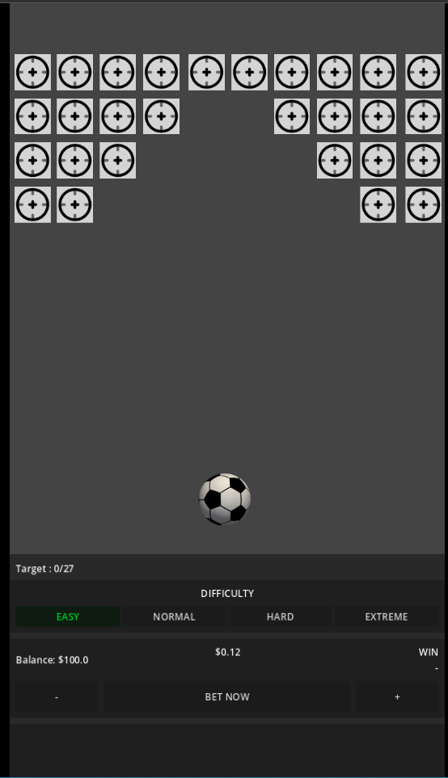

# Simple Soccer ⚽

A 2D arcade betting game built with **Godot Engine 4**. Test your luck and strategy by aiming for targets, increasing your multiplier, and avoiding the traps!

🎮 **[PLAY DEMO HERE](https://simple-soccer.vercel.app/)**



## 📋 About The Project

Simple Soccer is a luck-based simulation game where players wager a virtual balance to shoot a ball at various targets. Each successful hit increases the payout multiplier (Streak), but hitting a hidden "Trap" results in a loss. Players must decide when to push their luck or **Cashout** their winnings.

This project demonstrates core game development concepts in Godot 4 including physics interaction, global state management, audio processing, and UI responsiveness.

## ✨ Key Features

- **Dynamic Betting System:** Set your wager range ($0.5 - $10) and manage your balance.
- **4 Difficulty Levels:**
  - **Easy:** High win rate (90% RTP), requires 27 steps for Jackpot.
  - **Normal:** Balanced risk (70% RTP), requires 20 steps for Jackpot.
  - **Hard:** High risk (40% RTP), requires 10 steps for Jackpot.
  - **Extreme:** Very high risk (10% RTP), requires only 5 steps for Jackpot.
- **Progressive Multiplier:** Winnings multiply with every successful step (Streak).
- **Jackpot System:** Automatically win a massive payout if you survive enough steps.
- **Persistent Save System:** Your balance is saved automatically and persists even after closing the game.
- **Polished Audio:** Background music with auto-ducking effects, sound effects for interactions, and visual notifications.
- **Responsive UI:** Works well on both Desktop and Web builds.

## 🕹️ How to Play

1.  **Select Difficulty:** Choose between Easy, Normal, Hard, or Extreme.
2.  **Place Bet:** Adjust your bet amount using the `+` and `-` buttons.
3.  **Start Game:** Click **BET NOW** to lock in your wager.
4.  **Shoot:** Click on any available target to shoot the ball.
    - ✅ **Hit:** Your potential win increases. You can choose to shoot again or Cashout.
    - ❌ **Caught (Trap):** The ball hits a trap, and you lose your bet.
5.  **Cashout:** Click the **CASHOUT** button at any time to claim your current winnings.

## 🛠️ Technical Stack

- **Engine:** Godot 4.x
- **Language:** GDScript
- **Physics:** RigidBody2D & Area2D
- **Architecture:**
  - **Signals:** For decoupled communication between Nodes (Ball, Target, MainLevel).
  - **AutoLoad (Singleton):** Used for `GameData` (State/Logic) and `AudioManager`.
  - **RNG:** Weighted probability logic for RTP (Return to Player) calculation.

## 🚀 Installation & Setup

To run this project locally:

1.  **Clone the repository**
    ```bash
    git clone [hhttps://github.com/iip-jaelani16/simple-soccer](hhttps://github.com/iip-jaelani16/simple-soccer)
    ```
2.  **Import to Godot**
    - Open Godot Engine 4.
    - Click `Import`.
    - Navigate to the cloned folder and select `project.godot`.
3.  **Run the Project**
    - Press `F5` or click the Play button in the top right corner.
